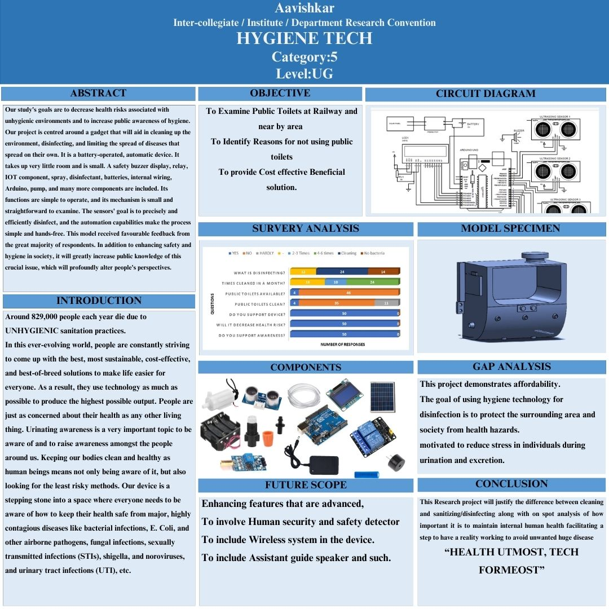

# 🧼 HYGIENE TECH – Automated Sanitation System

**A research-driven smart safety gadget designed to automate disinfection in public toilets, reducing health risks and limiting the spread of contagious diseases.**

---

## 📌 Problem Overview

Around **829,000 people die each year** due to unhygienic sanitation practices. In public spaces like railway stations, unhygienic environments facilitate the spread of:

- Bacterial infections (**E. Coli, Shigella**)  
- Airborne pathogens and fungal infections  
- STIs and Urinary Tract Infections (**UTI**)  

Existing challenges include inconsistent cleaning and highly contagious diseases in high-traffic public restrooms.  

**HYGIENE TECH** serves as a stepping stone to make public health a priority through **automated technology**.  

---

## 🎯 Objective

- Examine the state of public toilets at railways and nearby areas.  
- Identify reasons why the public avoids using existing facilities.  
- Provide a **cost-effective, beneficial, and automated disinfection solution**.  
- Increase public awareness regarding hygiene and sanitation.  

---

## 🧠 System Architecture

The system is a **battery-operated, automatic device** designed for efficiency and a compact footprint.  

### Core Components

| Component | Function |
|-----------|---------|
| **Arduino Uno** | Central processing unit |
| **Ultrasonic Sensors** | Precise object/user detection |
| **Relay & Pump** | Controls automated spray/disinfectant |
| **LCD Display & Buzzer** | Provides system status and safety alerts |
| **Solar Panel** | Sustainable power charging |
| **IoT Component** | Enables smart connectivity and monitoring |

---

## ⚙️ Working Methodology

1. **Detection**: Ultrasonic sensors monitor the environment to trigger the cleaning cycle.  
2. **Disinfection**: The system automatically dispenses disinfectant spray **hands-free**.  
3. **Safety Alerts**: Internal buzzer and display relay important system information to users.  
4. **Hands-Free Operation**: Automation limits human contact with unhygienic surfaces.  

> This straightforward mechanism is compact, easy to examine, and received **favorable feedback** from survey respondents.  

---

## 📊 Gap Analysis

| Focus Area | How HYGIENE TECH Addresses It |
|------------|-------------------------------|
| **Affordability** | Cost-effective approach to public health |
| **Health Protection** | Reduces societal health hazards |
| **Stress Reduction** | Lowers individual stress while using public toilets |

---

## 🖼 Project Visuals

> Poster embedded directly for quick recruiter view.  

---

## 🚀 Future Scope

- **Advanced Features**: Enhance disinfection logic with more complex sensors.  
- **Human Security**: Integrate human safety detection.  
- **Wireless Integration**: Transition to a fully wireless system for easier installation.  
- **Assistant Guide**: Include a speaker for guided instructions.  

---

## 🏆 Research Recognition

Presented at **Aavishkar Inter-Collegiate/Institute/Department Research Convention (UG Level, Category 5)**.  

*"HEALTH UTMOST, TECH FORMOST"*  

---

## 👩‍💻 Author

**Hiral Dhakoliya**  
B.Sc. Computer Science | University of Mumbai  

Focused on building **research-backed, real-world technology systems** combining engineering logic with product thinking.
